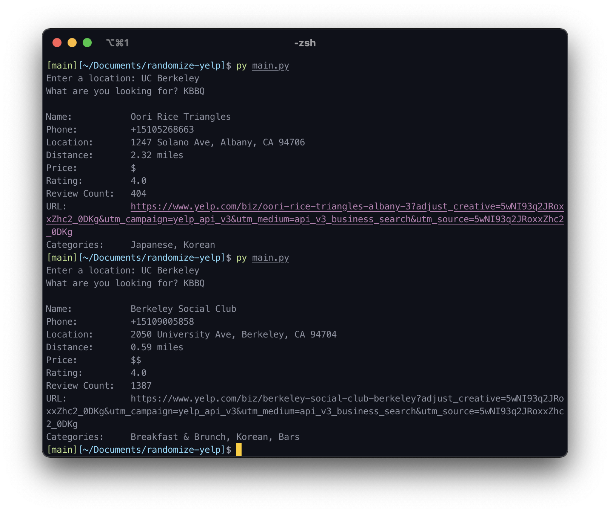

# randomize-yelp

**Author: Jesnine Erillo**

Simple application playing with Yelp API that randomly selects a business given a search query.

## Preview

Here we can see that I entered "UC Berkeley" as my search location and specified that I was looking for "KBBQ". In the screenshot below, I ran the program twice with the same values so you can see that the output is randomized.

