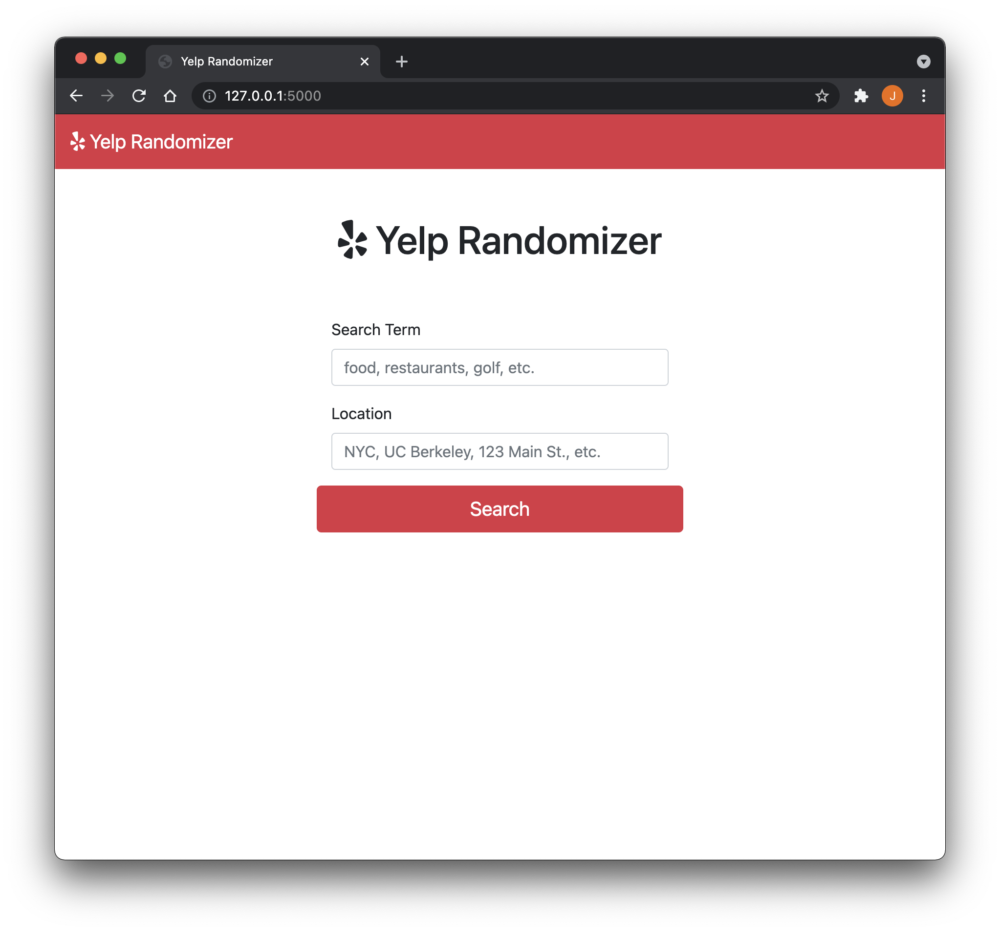
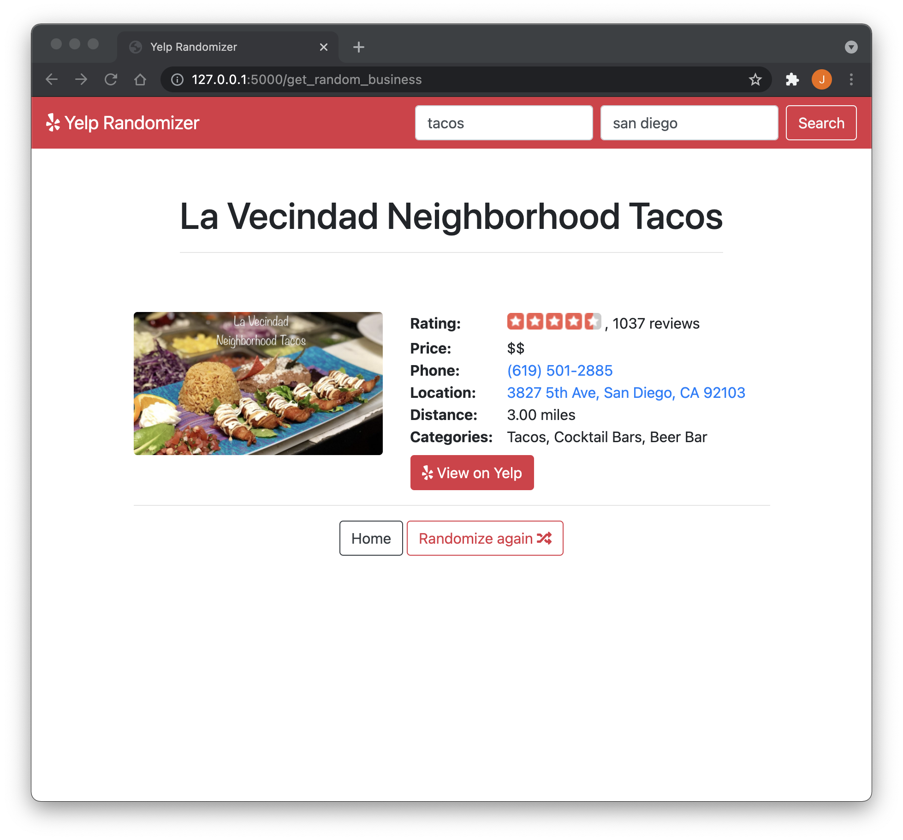

# Yelp Randomizer

**Author: Jesnine Erillo**

This application randomly selects a business given a search query using the Yelp Fusion API.

## Inspiration

My friends and I always spend so much time just trying to decide on where to go, so this simplifies that thought process by making a decision for us! :)

## Running Locally

1. Create a Yelp app to retrieve your API Key: [https://www.yelp.com/developers/v3/manage_app](https://www.yelp.com/developers/v3/manage_app)
2. Enter your private API Keys into `secret.py.example` and rename the file to `secret.py`
3. Run `export FLASK_APP=main` then `flask run`

## Preview

### Web app interface

